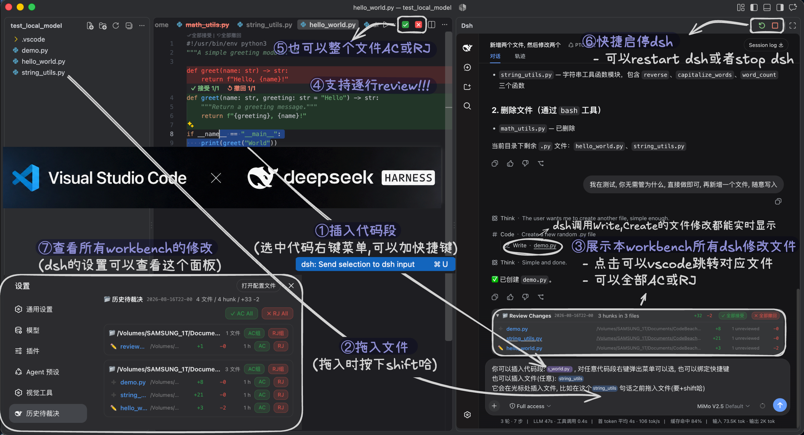

# dsh-vscode-review


一个仓库装齐 dsh 插件 + VS Code 插件。



| 文件夹 | 内容 | 说明 |
|---|---|---|
| `packages/` | `dsh-review` + `dsh-review-changes` | dsh 侧：journal / 工具 / Review Changes 面板 |
| `vscode_dsh_plugin/` | VS Code 扩展 + VSIX | VS Code 内联 diff + 右侧 dsh 面板 |

## 一键安装（同时安装 dsh 和 VS Code）

```bash
git clone --recurse-submodules https://github.com/Tlyer233/dsh-vscode-review.git
cd dsh-vscode-review
./install.sh
```

Windows PowerShell：

```powershell
git clone https://github.com/Tlyer233/dsh-vscode-review.git
cd dsh-vscode-review
.\install.ps1
```

脚本会依次：

1. `dsh plugin --profile web add ./packages/dsh-review`
2. `dsh plugin --profile web add ./packages/dsh-review-changes`
3. `code --install-extension ./vscode_dsh_plugin/dsh-review-vscode-0.1.0.vsix --force`

完成后：
- 重启 dsh web；
- VSCode 执行 `Developer: Reload Window`。

## 手动安装

dsh 侧：

```bash
dsh plugin --profile web add ./packages/dsh-review
dsh plugin --profile web add ./packages/dsh-review-changes
```

VS Code 侧：

```bash
code --install-extension ./vscode_dsh_plugin/dsh-review-vscode-0.1.0.vsix --force
```

## 升级 / 卸载

```bash
dsh plugin --profile web update @dsn/dsh-review review-changes
dsh plugin --profile web remove @dsn/dsh-review review-changes
```

## License

MIT
